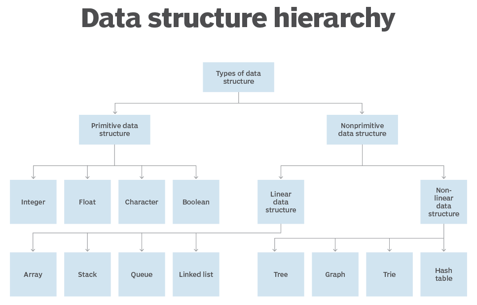
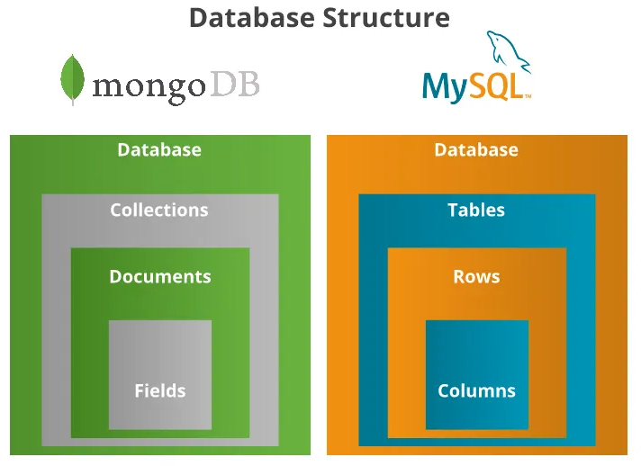
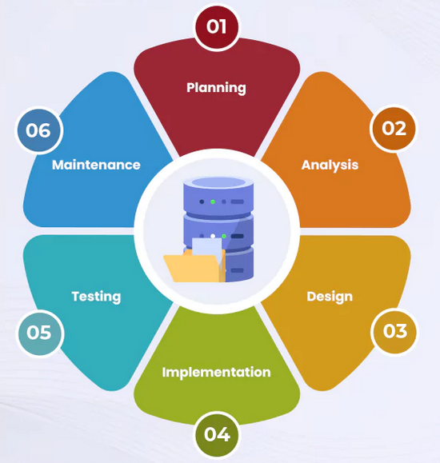
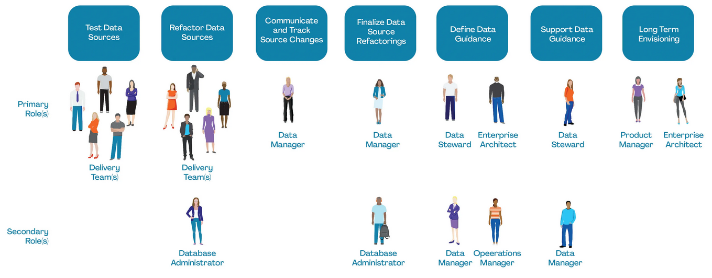
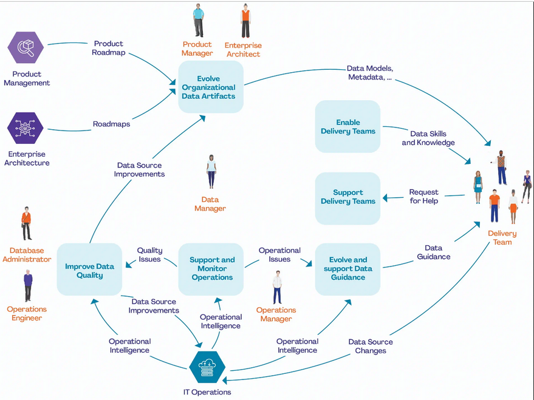
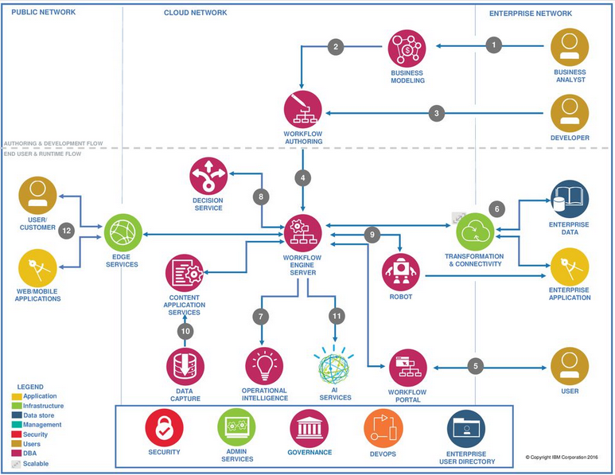

# Creación y Administración de Bases de Datos
---

## Estructuras y Manejo de Datos para Bases de Datos  

### Esquema de la Lección

#### 1. Introducción a las Estructuras de Datos en Bases de Datos
- Definición e Importancia de las Estructuras de Datos en Bases de Datos
- Tipos de Estructuras de Datos comúnmente utilizadas:
  - Arreglos
  - Listas Enlazadas
  - Árboles
  - Tablas Hash

<p float="left" style="text-align:center">
  
</p>

Imagen tomada y adaptada de [data structures  - TechTarget](https://www.techtarget.com/searchdatamanagement/definition/data-structure).

Sin embargo cada motor de bases de datos maneja su propia terminología y estructuración de datos

<p float="left" style="text-align:center">
  
</p>

Imagen tomada y adaptada de [Battle of the Bases: MySQL vs. MongoDB - Medium](https://calebbbbs.medium.com/battle-of-the-bases-bcb7a562bddd).


#### 2. Arreglos y Listas en MySQL
- Arreglos
  - MySQL no soporta arreglos directamente.
  - Alternativa: Usar tablas normalizadas para simular arreglos.
- Ejemplo:
  ```sql
  CREATE TABLE ArrayExample (
      id INT AUTO_INCREMENT PRIMARY KEY,
      value VARCHAR(255)
  );
  ```
- Listas Enlazadas
  - Implementación de una estructura de lista enlazada simple usando tablas auto-referenciadas.
- Ejemplo:
  ```sql
  CREATE TABLE LinkedList (
      node_id INT AUTO_INCREMENT PRIMARY KEY,
      value VARCHAR(255),
      next_node_id INT,
      FOREIGN KEY (next_node_id) REFERENCES LinkedList(node_id)
  );
  ```

#### 3. Árboles en MySQL
- Árboles y Su Importancia
  - Árboles Binarios
  - Árboles B
  - Datos Jerárquicos
- Ejemplo de una Estructura de Datos Jerárquica (Modelo de Lista de Adyacencia):
  ```sql
  CREATE TABLE TreeNode (
      node_id INT AUTO_INCREMENT PRIMARY KEY,
      parent_id INT,
      value VARCHAR(255),
      FOREIGN KEY (parent_id) REFERENCES TreeNode(node_id)
  );
  ```

#### 4. Tablas Hash en MySQL
- Tablas Hash
  - Concepto de hashing en bases de datos
  - Implementación en MySQL usando índices
- Ejemplo:
  ```sql
  CREATE TABLE HashTable (
      id INT AUTO_INCREMENT PRIMARY KEY,
      key_col VARCHAR(255),
      value_col VARCHAR(255),
      INDEX (key_col)
  );
  ```

#### 5. Ejemplos Prácticos en MySQL
- **Creación y Uso de Arreglos**
  - Normalización de datos para simular un arreglo:
  ```sql
  INSERT INTO ArrayExample (value) VALUES ('Item 1'), ('Item 2'), ('Item 3');
  SELECT * FROM ArrayExample;
  ```
- **Creación y Gestión de Listas Enlazadas**
  - Inserción de nodos y actualización de referencias:
  ```sql
  INSERT INTO LinkedList (value, next_node_id) VALUES ('Node 1', NULL);
  INSERT INTO LinkedList (value, next_node_id) VALUES ('Node 2', 1);
  UPDATE LinkedList SET next_node_id = 2 WHERE node_id = 1;
  SELECT * FROM LinkedList;
  ```
- **Implementación y Consulta de Árboles**
  - Inserción y selección de datos jerárquicos:
  ```sql
  INSERT INTO TreeNode (parent_id, value) VALUES (NULL, 'Root');
  INSERT INTO TreeNode (parent_id, value) VALUES (1, 'Child 1');
  INSERT INTO TreeNode (parent_id, value) VALUES (1, 'Child 2');
  SELECT * FROM TreeNode;
  ```
- **Creación y Consulta de Tablas Hash**
  - Inserción y consulta de datos hash:
  ```sql
  INSERT INTO HashTable (key_col, value_col) VALUES ('Key1', 'Value1'), ('Key2', 'Value2');
  SELECT * FROM HashTable WHERE key_col = 'Key1';
  ```


### Conclusión
Esta lección cubrió las estructuras de datos fundamentales utilizadas en las bases de datos y cómo implementarlas en MySQL. Al comprender estos conceptos y practicar con ejemplos prácticos, los estudiantes estarán equipados para diseñar y gestionar bases de datos eficientes para diversas aplicaciones.


### Referencias

- [MYSQL - Chapter 13 Data Types](https://dev.mysql.com/doc/refman/8.0/en/data-types.html)
- [What data structure does MySQL use to store data? Is it a binary tree or any special form of binary tree?](https://www.quora.com/What-data-structure-does-MySQL-use-to-store-data-Is-it-a-binary-tree-or-any-special-form-of-binary-tree)
- [What are data structures? Types of data structures used in SQL](https://planetscale.com/learn/articles/types-of-sql-data-structures)
---

# Administración de las Bases de Datos: Ciclo de Vida e Historias de Usuarios

---


### Esquema de la Lección

#### 1. Introducción al Ciclo de Vida de las Bases de Datos
- Definición e Importancia del Ciclo de Vida de una Base de Datos
- Fases del Ciclo de Vida de una Base de Datos:
  
  - Planificación
  - Análisis de Requisitos
  - Diseño
  - Implementación
  - Pruebas
  - Despliegue
  - Mantenimiento
  - Evolución

En resumen, el ciclo de una base de datos se puede ver así:

<p float="left" style="text-align:center">
  
</p>

Imagen tomada y adaptada de [Database Development Lifecycle](https://www.talentelgia.com/blog/database-development-lifecycle/). 


#### 2. Fases del Ciclo de Vida de una Base de Datos

##### Planificación
- Objetivo: Definir el propósito y alcance del proyecto de la base de datos.
- Actividades:
  - Identificación de interesados/inversores (stakeholders).
  - Definición de objetivos y requerimientos preliminares.
  - Evaluación de viabilidad.

##### Análisis de Requisitos
- Objetivo: Recoger y documentar los requisitos del sistema.
- Actividades:
  - Reuniones con interesados/inversores (stakeholders).
  - Creación de especificaciones funcionales y no funcionales.
  - Documentación de requisitos.

##### Diseño
- Objetivo: Crear el modelo conceptual, lógico y físico de la base de datos.
- Actividades:
  - Modelado de datos (diagramas ER, modelos relacionales).
  - Normalización de datos.
  - Diseño de tablas, índices y restricciones.

##### Implementación
- Objetivo: Construir la base de datos basada en el diseño.
- Actividades:
  - Creación de la base de datos y sus objetos (tablas, índices, etc.).
  - Carga de datos iniciales.
  - Desarrollo de scripts y procedimientos almacenados.

##### Pruebas
- Objetivo: Asegurar que la base de datos cumple con los requisitos.
- Actividades:
  - Pruebas de funcionalidad.
  - Pruebas de rendimiento.
  - Validación de datos.

##### Despliegue
- Objetivo: Poner la base de datos en producción.
- Actividades:
  - Migración de datos.
  - Configuración de servidores.
  - Monitoreo inicial post-despliegue.

##### Mantenimiento
- Objetivo: Garantizar el funcionamiento continuo y eficiente de la base de datos.
- Actividades:
  - Backup y recuperación.
  - Optimización de rendimiento.
  - Aplicación de parches y actualizaciones.

##### Evolución
- Objetivo: Adaptar la base de datos a cambios futuros.
- Actividades:
  - Modificaciones de esquema.
  - Integración con nuevos sistemas.
  - Escalabilidad.

#### 3. Historias de Usuarios
- Definición e Importancia de las Historias de Usuarios
- Estructura de una Historia de Usuario:
  - **Título:** Una breve descripción de la funcionalidad.
  - **Narrativa:** Como [rol], quiero [acción], para [beneficio].
  - **Criterios de Aceptación:** Condiciones que deben cumplirse para que la historia sea considerada completa.


#### 4. Ejemplos Prácticos de Historias de Usuarios en el Ciclo de Vida de una Base de Datos

**Ejemplo 1: Creación de una Base de Datos de una Librería Online**
- **Título:** Gestión de Inventario de Libros
- **Narrativa:** Como administrador de la librería, quiero poder agregar, modificar y eliminar libros del inventario, para mantener el catálogo actualizado.
- **Criterios de Aceptación:**
  - El administrador puede agregar un nuevo libro con título, autor, género y precio.
  - El administrador puede actualizar la información de un libro existente.
  - El administrador puede eliminar un libro del inventario.

**Ejemplo 2: Creación de un Grupo de Archivos**
- **Título:** Organización de Archivos
- **Narrativa:** Como DBA, quiero crear grupos de archivos para almacenar los datos de ventas y clientes, para optimizar el rendimiento y la administración de datos.
- **Criterios de Aceptación:**
  - Los datos de ventas se almacenan en un grupo de archivos dedicado.
  - Los datos de clientes se almacenan en un grupo de archivos separado.
  - La base de datos es capaz de realizar consultas de manera eficiente entre estos grupos de archivos.

**Ejemplo 3: Gestión de la Base de Datos**
- **Título:** Backup y Recuperación de Datos
- **Narrativa:** Como DBA, quiero configurar políticas de backup y recuperación, para asegurar la integridad y disponibilidad de los datos.
- **Criterios de Aceptación:**
  - Los backups se realizan de manera automática cada noche.
  - Los backups se almacenan en un servidor externo seguro.
  - Se prueba la recuperación de datos semanalmente para asegurar la fiabilidad.

---

### Conclusión
Esta lección ha cubierto el ciclo de vida completo de una base de datos, desde la planificación hasta la evolución, así como la importancia de las historias de usuarios en la gestión y diseño de bases de datos. Los estudiantes deben ahora ser capaces de aplicar estos conceptos en proyectos de bases de datos y comprender cómo las historias de usuarios pueden guiar el desarrollo y la mejora continua de las bases de datos.

### Tarea
1. Crear tres historias de usuarios relacionadas con la implementación de la base de datos que seleccionaron para el proyecto.
2. Describir cada fase del ciclo de vida de una base de datos aplicándola a su proyecto de curso.

### Referencias

- [User Story - Product Plan](https://www.productplan.com/glossary/user-story/)
- [Creating Good User Stories - Harvard University](https://archive.blogs.harvard.edu/markshead/good-user-stories/)
- [Writing User Stories for Back-end Systems](https://www.mountaingoatsoftware.com/blog/writing-user-stories-for-back-end-systems)
- [The Different Steps in Database Development Life Cycle](https://laura-malovich.medium.com/the-different-steps-in-database-development-life-cycle-aa79c92a0b8a) 
- 

---


<p float="left" style="text-align:center">
  
  

</p>

Imagenes tomadas y adaptadas de [Data Management Workflow – Internal](https://www.pmi.org/disciplined-agile/process/data-management/data-management-workflow-internal).

¿Dónde y con quién trabaja un administrador de base de datos?

<p float="left" style="text-align:center">
  
</p>

Imagen tomada y adaptada de [DBA Workflow Diagram Template](https://slideplayer.com/slide/17366501/).


<p float="left" style="text-align:center">
  
</p>

Imagen tomada y adaptada de [What are the roles, responsibilities, and skills required of a database administrator (DBA) in database system development?](https://www.quora.com/What-are-the-roles-responsibilities-and-skills-required-of-a-database-administrator-DBA-in-database-system-development).

<p float="left" style="text-align:center">
  
</p>

Imagen tomada y adaptada de [ Summary of DBA Activities](http://www.myreadingroom.co.in/notes-and-studymaterial/65-dbms/570-summary-of-dba-activities.html).
