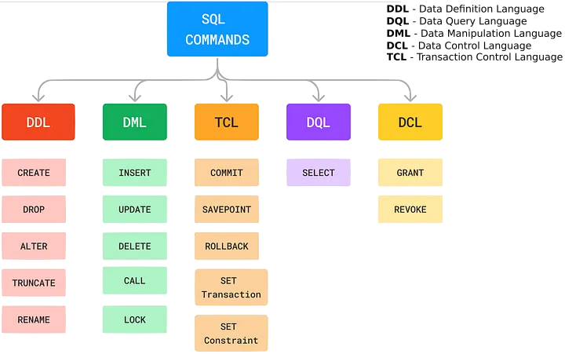
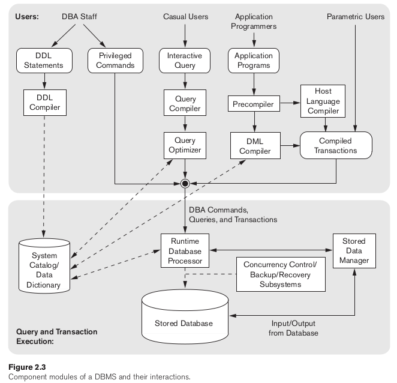

# Lenguajes de Bases de Datos

En esta lección, exploraremos los diferentes tipos de lenguajes de bases de datos y sus roles en la gestión de sistemas de gestión de bases de datos relacionales (RDBMS). Cubriremos las categorías de lenguajes de bases de datos, incluyendo Lenguaje de Definición de Datos (DDL), Lenguaje de Manipulación de Datos (DML), Lenguaje de Control de Datos (DCL), y otros (TCL, DQL), junto con sus respectivas funcionalidades y casos de uso.

<p float="left" style="text-align:center">
  
</p>

## 1. Introducción a los Lenguajes de Bases de Datos

Los lenguajes de bases de datos son lenguajes de programación especializados utilizados para interactuar con sistemas de gestión de bases de datos relacionales (RDBMS).

Principalmente hay tres tipos de lenguajes de bases de datos aunque se suelen definir dos más:

1. Lenguaje de Definición de Datos (DDL)
2. Lenguaje de Manipulación de Datos (DML)
3. Lenguaje de Control de Datos (DCL)
4. Lenguaje de Control de Transacciones (TCL)
5. Lenguaje de Consulta de Datos (DQL)

Un sistema de bases de datos proporciona un lenguaje de definición de datos (DDL) para especificar el esquema de la base de datos y un lenguaje de manipulación de datos (DML) para expresar las consultas y actualizaciones de la base de datos. En la práctica, los lenguajes de definición y manipulación de datos no son dos lenguajes distintos, sino que forman parte de un único lenguaje de base de datos, como el lenguaje SQL.

## 2. Lenguaje de Definición de Datos (DDL)

   - **Propósito:**
     - DDL se utiliza para definir la estructura y el esquema de una base de datos. También se usa para adicionar propiedades especificas de los datos.
   - **Funcionalidades:**
     - Crear, modificar y eliminar objetos de base de datos como tablas, vistas, índices, etc. 
     - Definir las restricciones de dominio, integridad referencial, y la autorización
   - **Comandos DDL comunes:**
     - `CREATE`: Crea nuevos objetos de base de datos.
     - `ALTER`: Modifica la estructura de los objetos de base de datos existentes.
     - `DROP`: Elimina objetos de base de datos existentes.
     - `TRUNCATE`: Se utiliza para eliminar todos los registros de una tabla, incluidos todos los espacios asignados a los registros se eliminan.
     - `RENAME`: Permite renombrar un objeto existente en la base de datos.
   - **Ejemplo:**

        ```sql
        CREATE TABLE Estudiantes (
            ID INT PRIMARY KEY,
            Nombre VARCHAR(50),
            Edad INT
        );
        ```
El procesamiento de las sentencias DDL, al igual que las de cualquier otro lenguaje de programación, genera alguna salida. La salida del DDL se coloca en el diccionario de datos, que contiene metadatos, es decir, datos sobre los datos. El diccionario de datos se considera un tipo especial de tabla a la que sólo puede acceder y actualizar el propio sistema de base de datos (no un usuario normal). El sistema de base de datos consulta el diccionario de datos antes de leer o modificar los datos reales.


## 3. Lenguaje de Manipulación de Datos (DML)

   - **Propósito:**
     - DML se utiliza para acceder y manipular datos dentro de la base de datos.
   - **Funcionalidades:**
     - Insertar, modificar, eliminar y recuperar datos de tablas.
   - **Comandos DML comunes:**
     - `INSERT`: Agrega nuevos registros a una tabla.
     - `UPDATE`: Modifica registros existentes en una tabla.
     - `DELETE`: Elimina registros de una tabla.
     - `SELECT`: Recupera datos de una o más tablas.
     - `LOCK`: Control de concurrencia de tablas.
     - `CALL`: Llama a un subprograma PL/SQL o JAVA.
     - `EXPLAIN PLAIN`: Describe la ruta de acceso a los datos.
   - **Ejemplo:**

        ```sql
        INSERT INTO Estudiantes (ID, Nombre, Edad) 
        VALUES (1, 'Juan', 25);
        ```

Existen básicamente dos tipos de lenguaje de manipulación de datos:
- Los **DML procedimentales** requieren que el usuario especifique qué datos necesita y cómo obtenerlos.
- Los **DML declarativos** (también denominados DML no procedimentales) requieren que el usuario especifique qué datos necesita sin especificar cómo obtenerlos.

Otro término que se suele utilizar es **consulta**. Una consulta es una declaración que solicita la recuperación de información. La parte de un DML que implica la recuperación de información se denomina lenguaje de consulta. Aunque técnicamente es incorrecto, es habitual utilizar los términos *lenguaje de consulta* y *lenguaje de manipulación de datos* como sinónimos.

## 4. Lenguaje de Control de Datos (DCL)

   - **Propósito:**
     - DCL se utiliza para controlar el acceso a la base de datos.
   - **Funcionalidades:**
     - Conceder y revocar permisos, privilegios y roles.
   - **Comandos DCL comunes:**
     - `GRANT`: Otorga privilegios específicos a usuarios de la base de datos.
     - `REVOKE`: Retira los privilegios previamente otorgados a usuarios.
     - `FLUSH PRIVILEGES`: Recargar las tablas de concesión para asegurarse de que los nuevos privilegios entran en vigor.
   - **Ejemplo:**
     ```sql
     GRANT SELECT ON Estudiantes TO 'usuario1'@'localhost';
     ```

## 5. Lenguaje de Control de Transacciones (TCL)

Las transacciones agrupan un conjunto de tareas en una única unidad de ejecución. Cada transacción comienza con una tarea específica y finaliza cuando todas las tareas del grupo se completan con éxito. Si alguna de las tareas falla, la transacción fracasa. Por lo tanto, una transacción sólo tiene dos resultados: éxito o fracaso.

   - **Propósito:**
     - TCL es un conjunto de comandos diseñados específicamente para gestionar los cambios realizados por las sentencias DML (como INSERT, UPDATE, DELETE).
   - **Funcionalidades:**
     - Permite controlar los procesos de transacción en una base de datos
   - **Comandos DCL comunes:**
     - `BEGIN`: Abre una transacción.
     - `COMMIT`: Cometer una transacción.
     - `ROLLBACK`: Deshace una transacción en caso de que se produzca algún error.
     - `SAVEPOINT`: Establece un punto de guardado dentro de una transacción.
   - **Ejemplo:**
     ```sql
     START TRANSACTION; 
     # .... code to execute .......
     COMMIT;
     ```

## Conclusión
Comprender los diferentes tipos de lenguajes de bases de datos es esencial para gestionar e interactuar eficazmente con bases de datos relacionales. Al dominar DDL, DML y DCL, los administradores y desarrolladores de bases de datos pueden diseñar, manipular y asegurar eficientemente bases de datos según los requisitos comerciales y los estándares de seguridad.


<p float="left" style="text-align:center">
  
</p>

## Ejercicio Práctico: Aplicación de Lenguajes de Bases de Datos en MySQL

En este ejercicio, aplicaremos los conceptos de los diferentes tipos de lenguajes de bases de datos (DDL, DML y DCL) en el contexto de una base de datos MySQL. Utilizaremos una base de datos ficticia llamada "universidad" que contiene información sobre estudiantes y cursos.

1. **Creación de la Estructura de la Base de Datos (DDL):**
   - Utilice el lenguaje DDL para crear la estructura de la base de datos "universidad", incluyendo las siguientes tablas:
     - Estudiantes: Con columnas para ID, Nombre y Edad.
     - Cursos: Con columnas para ID, Nombre y Descripción.

   ```sql
   CREATE DATABASE universidad;
   USE universidad;

   -- Tabla de Estudiantes
   CREATE TABLE Estudiantes (
       ID INT PRIMARY KEY,
       Nombre VARCHAR(50),
       Edad INT
   );

   -- Tabla de Cursos
   CREATE TABLE Cursos (
       ID INT PRIMARY KEY,
       Nombre VARCHAR(50),
       Descripcion TEXT
   );
   ```

2. **Inserción de Datos (DML):**
   - Utilice el lenguaje DML para insertar algunos registros de ejemplo en las tablas de estudiantes y cursos.

   ```sql
   -- Insertar estudiantes
   INSERT INTO Estudiantes (ID, Nombre, Edad) VALUES
   (1, 'Juan', 20),
   (2, 'María', 22),
   (3, 'Carlos', 21);

   -- Insertar cursos
   INSERT INTO Cursos (ID, Nombre, Descripcion) VALUES
   (101, 'Matemáticas', 'Curso de matemáticas avanzadas'),
   (102, 'Física', 'Curso de física básica'),
   (103, 'Programación', 'Curso de introducción a la programación');
   ```

3. **Concesión de Privilegios (DCL):**
   - Utilice el lenguaje DCL para otorgar permisos de consulta a un usuario específico en la tabla de estudiantes.

   ```sql
   -- Otorgar permisos de consulta a un usuario específico
   GRANT SELECT ON Estudiantes TO 'usuario1'@'localhost';
   ```


## Ejercicio para Casa

Implementación de cada comando de la sección 2 a la 5 (`INSERT`, `UPDATE`, `START`, etc) utilizando su propia base de datos. Cómo el tutorial es bastante simple agreguen registros y atributos, pueden utilizar chatGPT.

**Entregables:** Dos archivos sql con los códigos comentados por punto, un archivo sql para  el ejercicio práctico y otro para su base de datos. 


```sql
#--------------------------- primer punto -----------------------
...
...
#--------------------------- segundo punto -----------------------
...
...
...
```
## Referencias

### Libros

- Abraham Silberschatz, Henry Korth y S. Sudarshan. *Database System Concepts*. McGraw-Hill Education 7ma edición, 2020. Capítulo 1.4, página 15. 
- Ramez Elmasri y Shamkant Navathe. *Fundamentals of Database Systems*. Perason séptima edición, 2016. Capítulo 2.3, página 69.

### Guias en línea

- [Different Types Of SQL Commands](https://medium.com/@reetesh043/different-types-of-sql-commands-2acc78318c61)
- [Database Languages in DBMS](https://www.javatpoint.com/dbms-language)
- [SQL | DDL, DQL, DML, DCL and TCL Commands](https://www.linkedin.com/pulse/sql-ddl-dql-dml-dcl-tcl-commands-pintu-kumar-kushwaha/)
- [15.7.1.3 CREATE USER Statement](https://dev.mysql.com/doc/refman/8.0/en/create-user.html)
- [How To Create a New User and Grant Permissions in MySQL](https://www.digitalocean.com/community/tutorials/how-to-create-a-new-user-and-grant-permissions-in-mysql)