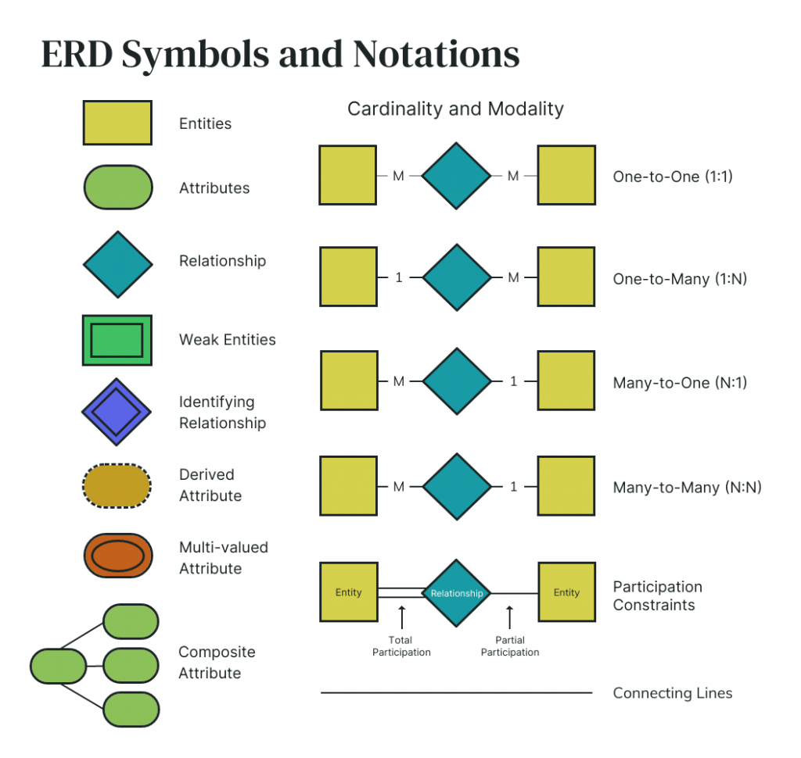
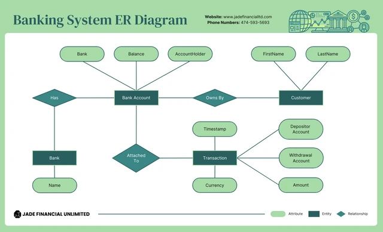
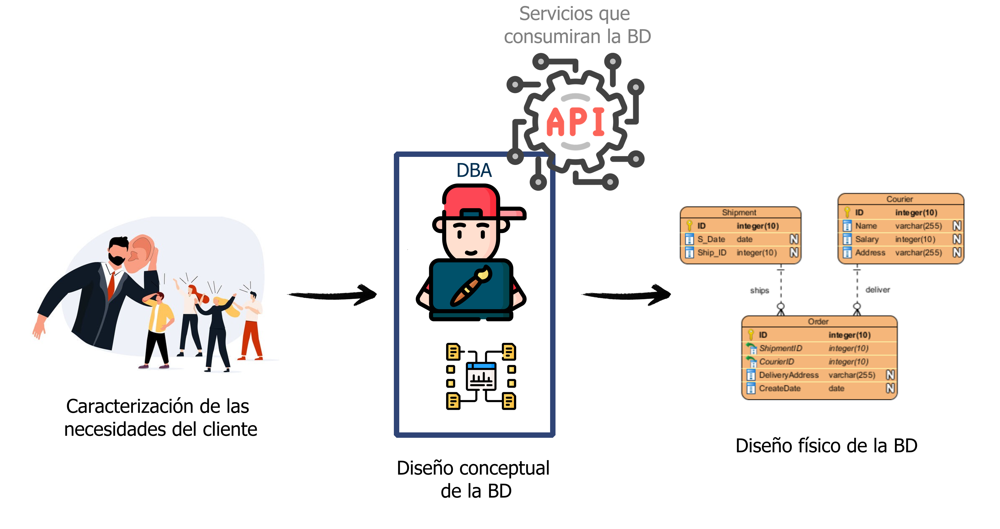
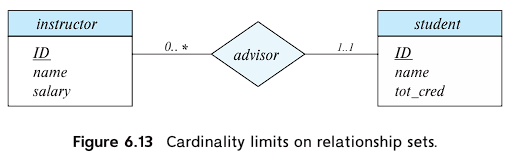
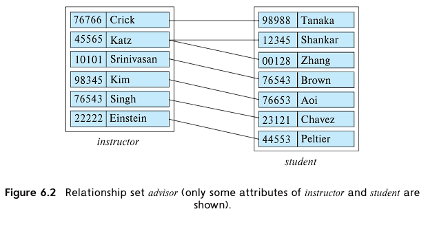
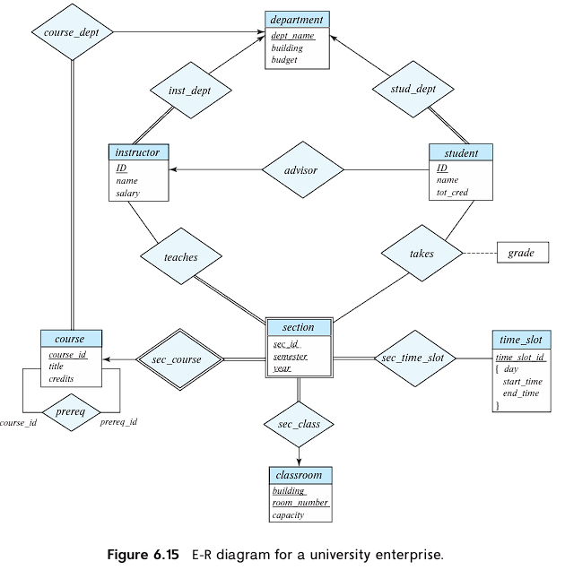
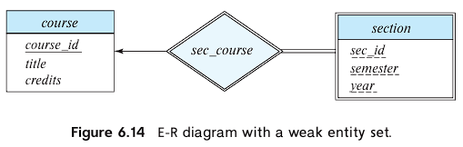
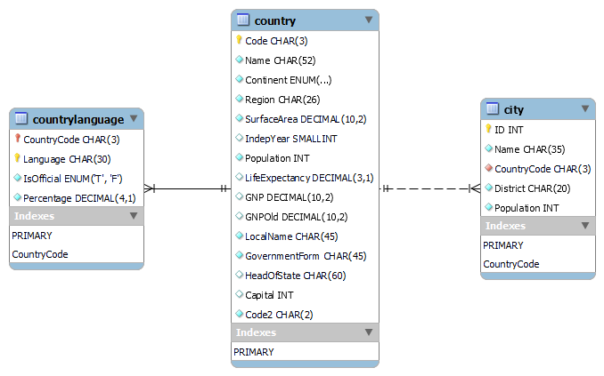

# Modelo Entidad-Relación (E/R)

## 1. Conceptos Básicos

El Modelo Entidad-Relación (E/R) es un modelo de datos conceptual utilizado para representar las entidades, atributos y relaciones dentro de un sistema de base de datos. Proporciona una representación gráfica de la estructura de la base de datos, lo que permite a los interesados comprender la organización de los datos y las interacciones entre las entidades.

<p float="left" style="text-align:center">
  
</p>

Cada entidad contiene atributos clave, incluida una clave primaria que identifica de forma exclusiva cada registro dentro del conjunto de entidades. Las relaciones, representadas por líneas entre estas entidades, muestran cómo los datos de una entidad se relacionan con los datos de otra, ya sea a través de un emparejamiento de clave primaria y clave externa en una relación de uno a muchos o una relación de muchos a muchos que requiere una tabla de unión. 

<p float="left" style="text-align:center">
   
</p>

Tomado de y adaptado de [What is an Entity Relationship Diagram and How to Draw one?](https://venngage.com/blog/entity-relationship-diagram/).

## 2. Fases del diseño de BD

<p float="left" style="text-align:center">
   
</p>


## 3. Características y Aplicaciones

- **Flexibilidad:** El modelo E/R ofrece flexibilidad para representar escenarios del mundo real al abstraer estructuras complejas en entidades y relaciones más simples.
- **Claridad:** Proporciona una visualización clara e intuitiva del esquema de la base de datos, ayudando en la comunicación entre los interesados.
- **Estandarización:** El modelo E/R sigue una notación y terminología estandarizadas, lo que lo hace ampliamente aceptado y comprendido en la comunidad de bases de datos.
-  **Redundancia:** Un mal diseño puede repetir información. Por ejemplo, si almacenamos el identificador y el título de un curso con cada oferta de curso, el título se almacenaría almacenado de forma redundante (es decir, varias veces, innecesariamente) con cada oferta de curso. El mayor problema de esta representación redundante de la información es que las copias de una información pueden ser incoherentes si la información se actualiza sin tomar precauciones para actualizar todas las copias de la información.
- **Incompletitud:** Un mal diseño puede hacer que ciertos aspectos de la empresa sean difíciles o imposibles de modelizar. De forma equivalente, en términos de relaciones, supongamos que tenemos una única relación en la que repetimos toda la información del curso una vez por cada sección en la que se ofrece el curso. Entonces sería imposible representar información sobre un nuevo curso, a menos que ese curso se ofrezca.

## 4. Elementos del Modelo E/R

- **Entidades:** Representan objetos o conceptos del mundo real, como una persona, lugar o cosa. En el modelo E/R, las entidades se representan como rectángulos. Usualmente su nombre es un pronombre.
- **Atributos:** Son propiedades o características de las entidades. Los atributos se representan como óvalos conectados a sus respectivas entidades.
- **Relaciones:** Son asociaciones entre entidades que describen cómo están relacionadas entre sí. Las relaciones se representan como diamantes que conectan las entidades relacionadas.
- **Líneas de conexión:** Las líneas continuas se utilizan para conectar entidades con atributos y entidades con relaciones, ilustrando la vinculación entre ellas.
- **Cardinalidad y modalidad:** Son los indicadores de la naturaleza de la relación entre entidades. La cardinalidad se refiere al número de instancias de una entidad que pueden o deben asociarse a cada instancia de otra entidad. La modalidad (u opcionalidad) indica si una instancia de una entidad es obligatoria o no y puede mostrarse mediante un círculo (opcional) o una barra (obligatoria). 

<p float="left" style="text-align:center">
   
</p>
  
  - **Uno a uno (1:1):** Una única instancia de una entidad se asocia con una única instancia de otra entidad.
  - **Uno a varios (1:N):** Una única instancia de una entidad se asocia con muchas instancias de otra entidad.
    <p float="left" style="text-align:center">
       
    </p>
  
  - **Muchos a uno (N:1):** Muchas instancias de una entidad están asociadas a una única instancia de otra entidad.
  - **Muchos a muchos (N:N):** Muchas instancias de una entidad están asociadas con muchas instancias de otra entidad. <br>
  Diagrama completo sobre una univerisdad.
<p float="left" style="text-align:center">
   
</p>
  
- **Entidades débiles:** A veces representada por un doble rectángulo, una entidad débil es una entidad que no puede existir en la base de datos sin la existencia de otra entidad (su propietario).
  <p float="left" style="text-align:center">
   
  </p>
  
- **Atributo derivado:** Representado por un óvalo discontinuo, un atributo derivado es aquel cuyo valor se calcula a partir de otros atributos.
- **Atributo compuesto:** Si un atributo está formado por varios componentes, se muestra como un óvalo con óvalos en su interior, indicando la composición.
- **Atributo multivalor:** Representado por un óvalo doble, un atributo multivaluado puede tener más de un valor para una misma entidad (como varios números de teléfono para una misma persona).
- **Restricciones de participación:** A veces, existen restricciones sobre la forma en que las entidades participan en las relaciones, que se representan colocando "parcial" o "total" en las líneas que conectan las entidades con las relaciones.

## 5. Requisitos para una Relación

Para que exista una relación entre entidades, se deben cumplir ciertas condiciones:

- **Existencia de Entidades:** Ambas entidades involucradas en la relación deben existir. Por ejemplo, para establecer una relación entre "País" y "Ciudad" en la base de datos "world", ambas entidades deben estar definidas previamente.
- **Asociación:** Debe haber una asociación o conexión significativa entre las entidades. Por ejemplo, una ciudad debe pertenecer a un país específico para establecer una relación entre ellos.
- **Cardinalidad:** La cardinalidad define el número de ocurrencias de una entidad que están asociadas con el número de ocurrencias de otra entidad. Incluye valores mínimos y máximos, como relaciones uno a uno, uno a muchos o muchos a muchos.
- **Participación:** La participación indica si una entidad debe o no participar en una relación. Puede ser total (obligatoria) o parcial (opcional).
- **Claves:** Las claves son atributos o conjuntos de atributos que identifican de manera única a las entidades dentro de una relación. Pueden ser claves primarias (PK) o claves foráneas (FK).

## Ejemplo utilizando la Base de Datos *world*

Describamos la base de datos "world":

- Entidad: **country**
  Atributos: `Code`, `Name`, `Continent`, `Region`, `SurfaceArea`, `IndepYear`, `Population`, `LifeExpectancy`, `GNP`, `GNPOld`, `LocalName`, `GovernmentForm`, `HeadOfState`, `Capital`, `Code2`

- Entidad: **city**
  Atributos: `ID`, `Name`, `CountryCode`, `District`,`Population`

- Entidad: **countrylanguage**
  Atributos: `CountryCode`, `Language`, `IsOfficial`, `Percentage`

Estos datos los puedes ver utilizando el comando `describe` de MySQL

```sql
DESCRIBE database_name.table_name;
```

Diagrama ejemplo de la base de datos relacional world

<p float="left" style="text-align:center">
   
</p>

- Relación: `country-city`
  - Cardinalidad: Uno a muchos (Un país puede tener muchas ciudades)
  - Participación: Total en el lado de los países (Todos los países deben tener al menos una ciudad)
  - Claves: `country.Code` (Clave primaria), `city.CountryCode` (Clave foránea)
  
- Relación: `country-countrylanguage`
  - Cardinalidad: Uno a muchos (Un país puede tener muchos idiomas)
  - Participación: Total en el lado de los países (Todos los países deben tener al menos un idioma)
  - Claves: `country.Code` (Clave primaria), `countrylanguage.CountryCode` (Clave foránea)

## Conclusión

El Modelo Entidad-Relación es una herramienta fundamental en el diseño de bases de datos, que permite a los desarrolladores conceptualizar y visualizar la estructura de un sistema de base de datos. Comprender los conceptos básicos, características, elementos y requisitos del modelo E/R es esencial para diseñar bases de datos eficientes y efectivas. Mediante ejemplos de la base de datos "world", los estudiantes pueden aplicar estos conceptos en escenarios del mundo real y adquirir experiencia práctica en modelado y diseño de bases de datos.

## Ejercicio: Creación del Diagrama de Entidad-Relación para la Base de Datos "mydb"**

Este ejercicio consiste en crear un diagrama de entidad-relación (ER) para la base de datos **etitc** que consista en cuatro tablas, cada una conteniendo más de cuatro atributos. Para poblar (llenar) la tabla utiliza chatGPT. Utiliza la ingeniería inversa para generar el esquema de la base de datos a partir del diagrama utilizando MySQL Workbench.

#### Instrucciones:

1. Identifica las entidades y sus atributos para la base de datos "etitc".

2. Dibuja un diagrama de entidad-relación (ER) que represente las relaciones entre las entidades.

3. Incluye al menos cuatro tablas en el diagrama ER, cada una conteniendo más de tres atributos.

4. Define relaciones apropiadas (uno a uno, uno a muchos o muchos a muchos) entre las tablas.

5. Exporta el diagrama ER desde tu herramienta de modelado elegida (por ejemplo, draw.io, Lucidchart, o Workbrench) como un archivo de imagen.

6. Utiliza MySQL Workbench para realizar la ingeniería inversa y generar el esquema de la base de datos a partir del diagrama ER.

7. Verifica el esquema generado en MySQL Workbench para asegurarte de que represente con precisión la estructura definida en el diagrama ER.

####  Entidades y Atributos para "etitc":

1. **Tabla 1: Empleados**
   - Atributos: ID_Empleado (Clave Primaria), Nombre, Apellido, Correo_Electrónico, Puesto
   
2. **Tabla 2: Departamentos**
   - Atributos: ID_Departamento (Clave Primaria), Nombre_Departamento, ID_Gerente, Ubicación
   
3. **Tabla 3: Proyectos**
   - Atributos: ID_Proyecto (Clave Primaria), Nombre_Proyecto, Fecha_Inicio, Fecha_Fin, Presupuesto
   
4. **Tabla 4: Tareas**
   - Atributos: ID_Tarea (Clave Primaria), Descripción_Tarea, Fecha_Vencimiento, Estado, Asignado_A

#### Relaciones:
- *Empleados y Departamentos:* Uno a muchos (Un empleado pertenece a solo un departamento, pero un departamento puede tener varios empleados)
- *Departamentos y Proyectos:* Uno a muchos (Un proyecto pertenece a solo un departamento, pero un departamento puede tener varios proyectos)
- *Empleados y Tareas:* Uno a muchos (Un empleado puede ser asignado a varias tareas, pero una tarea se asigna a solo un empleado)
- *Proyectos y Tareas:* Uno a muchos (Un proyecto puede tener varias tareas, pero una tarea pertenece solo a un proyecto)
- *Empleados y Proyectos:* Muchos a muchos (Un empleado puede trabajar en varios proyectos y un proyecto puede tener varios empleados asignados)
- *Empleados y Empleados (Supervisor-Supervisado):* Uno a muchos (Un empleado puede ser supervisor de varios empleados, pero un empleado solo tiene un supervisor)
- *Empleados y Departamentos (Asignación):* Muchos a muchos (Un empleado puede ser asignado a varios departamentos y un departamento puede tener varios empleados asignados)
- *Proyectos y Departamentos (Asignación):* Muchos a muchos (Un proyecto puede estar asociado con varios departamentos y un departamento puede estar asociado con varios proyectos)

Selecciona y dibuja 3 relaciones de uno a muchos y 3 relaciones de muchos a muchos. 

####  Entregables:
1. Diagrama ER que ilustre las entidades, atributos y relaciones para la base de datos "etitc".
2. Script SQL generado por MySQL Workbench después de la ingeniería inversa.
3. Captura de pantalla de verificación que muestre el esquema generado en MySQL Workbench. Como el que se solicito en el parcial.

**Nota:** Asegúrate de que las relaciones y atributos estén definidos adecuadamente en el diagrama ER, y que el proceso de ingeniería inversa traduzca con precisión el diagrama en un esquema de base de datos MySQL.

## Referencias

- [The-MySQL-Workshop](https://github.com/PacktWorkshops/The-MySQL-Workshop/tree/master)
- [ER Diagrams (Data Modeling)](https://github.com/mehdihadeli/awesome-software-architecture/blob/main/docs/modeling/er-diagrams.md)
- [Awesome Database Design Awesome](https://github.com/sujeet-agrahari/awesome-database-design?tab=readme-ov-file)
- [Domain Modeling & ERDs](https://github.com/sei-relativity/lesson-w07d05-Entity-Relationship-Diagram)
- [MySQL: Entity Relationship Model](https://www.linkedin.com/pulse/mysql-entity-relationship-model-cyclobold-tech/)
