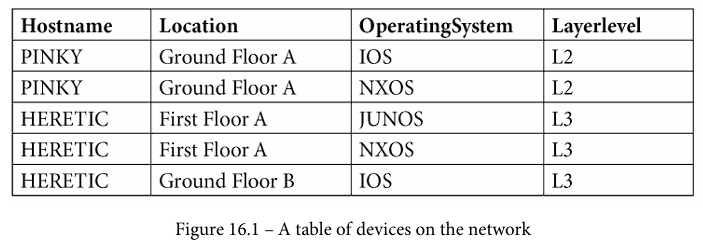
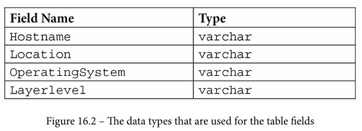
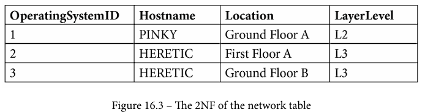
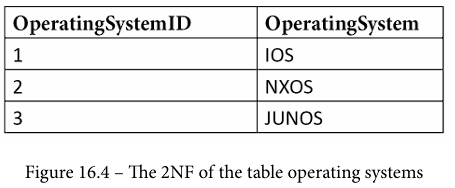
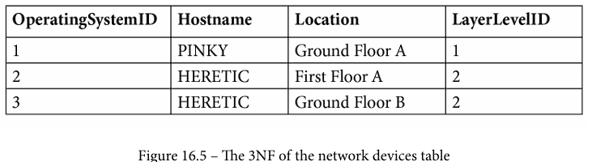
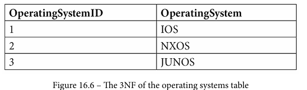
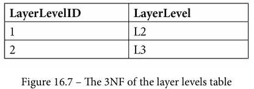

# Normalización en las Bases de Datos

## Fundamentos y Conceptos
La normalización es un proceso fundamental en el diseño de bases de datos relacionales que se centra en organizar datos de manera eficiente para minimizar la redundancia y mantener la integridad de los datos. Algunos conceptos clave incluyen:
- **Redundancia de Datos:** Ocurre cuando la misma información se almacena en múltiples lugares. Los datos redundantes desperdician espacio en disco y crean problemas de mantenimiento. Si hay que modificar datos que existen en más de un lugar, los datos deben modificarse exactamente de la misma manera en todos los lugares. Un cambio en la dirección de un cliente es más fácil de implementar si esos datos se almacenan sólo en la tabla Clientes y en ningún otro lugar de la base de datos. 
- **Integridad de los Datos:** Se refiere a la precisión y consistencia de los datos en la base de datos.
- **Dependencias Funcionales:** Son las relaciones entre los atributos de una tabla que describen cómo determinados atributos dependen de otros.

## Objetivos y Propósitos
Los principales objetivos de la normalización son:
- Reducir la redundancia de datos.
- Mejorar la integridad de los datos.
- Facilitar el mantenimiento y la actualización de la base de datos.
- Evitar problemas de actualización y eliminación anómalos.
- Facilitar la búsqueda y recuperación de datos.

## Tipos y Características de las Formas Normales
Existen diferentes niveles de normalización, conocidos como Formas Normales (FN), que representan estados progresivos de organización de datos. Algunos tipos comunes de FN incluyen:
1. **Primera Forma Normal (1FN):** 
   - Elimina la duplicación de grupos de datos y asegura que cada campo contenga un solo valor.
   - Crea una tabla distinta para cada conjunto de datos relacionados.
   - Identifica cada conjunto de datos relacionados con una clave primaria.
2. **Segunda Forma Normal (2FN):** 
   - Elimina la dependencia parcial de los campos de clave primaria, dividiendo la tabla en varias tablas relacionadas.
   - Cree tablas separadas para conjuntos de valores que se apliquen a varios registros.
   - Relacione estas tablas con una clave externa.
3. **Tercera Forma Normal (3FN):** 
   - Elimina la dependencia transitiva, donde los campos no dependen de otros campos que no sean la clave primaria, es decir, elimina los campos que no dependen de la clave.
4. **Cuarta Forma Normal (4FN) / Forma Normal de Boyce-Codd (BCNF):** Extensión de 3FN que elimina las dependencias funcionales no triviales entre los atributos de una clave candidata.
5. **Quinta Forma Normal (5FN):** Abordan problemas específicos de dependencias multivaluadas y dependencias de unión, respectivamente.

## Dominio y Aplicaciones
- **Dominio:** Se refiere al conjunto de valores que puede tomar un atributo en una tabla. La definición precisa del dominio es crucial para garantizar la validez y consistencia de los datos.
- **Aplicaciones:** La normalización se aplica en una amplia variedad de aplicaciones y entornos, incluyendo sistemas de gestión de bases de datos, aplicaciones web, sistemas de gestión empresarial y más. Es especialmente útil en entornos donde la integridad de los datos y la eficiencia en el acceso son críticas.

## Ejemplo
Supongamos que tenemos una tabla "Estudiantes" con los siguientes atributos: (ID Estudiante, Nombre, Dirección, Teléfono, ID Curso). Para normalizar esta tabla:
- En 1FN, eliminamos la duplicación de datos y aseguramos que cada campo tenga un solo valor.
- En 2FN, dividimos la tabla en dos: "Estudiantes" (ID Estudiante, Nombre, Dirección, Teléfono) y "Inscripciones" (ID Estudiante, ID Curso).
- En 3FN, eliminamos la dependencia transitiva y creamos una tabla adicional "Cursos" (ID Curso, Nombre Curso, Profesor).

## Conclusión
La normalización es un proceso esencial en el diseño de bases de datos que garantiza la eficiencia, integridad y consistencia de los datos. Comprender los fundamentos, objetivos y tipos de formas normales es fundamental para crear bases de datos bien estructuradas y optimizadas.

## Ejemplo Práctico

### Tabla de ejemplo

**1. Analiza la tabla**

  

**2. Describe la tabla**

  

### Normalización 2NF

**3. Crea una llave compuesta entre Hostname y Location**

**4. Utiliza la 2NF y la llave compuesta**

  

  

**5. Utiliza la 3NF**

  

  

  

## Ejercicio Práctico

Crea una tabla con chatGPT con más tuplas y atributos como la tabla en [Description of the database normalization basics](https://learn.microsoft.com/en-us/office/troubleshoot/access/database-normalization-description). Sigue la guia y aplica las tres formas de normalización.

## Ejercicio para casa

Utiliza estos mismo conceptos en tu propia base de datos.

## Referencias

#### Básicas

- Thomas Pettit y Scott Cosentino, *The MySQL Workshop: A practical guide to working with data and managing databases with MySQL*. Packt Publishing, 2022. Capítulo Normalization, página 19; Apendix, página 632.
- Ramez Elmasri y Shamkant B. Navathe. *Fundamentals of Database Systems*. Pearson, 2015. Capítulo 14, página 490. 
- [Description of the database normalization basics](https://learn.microsoft.com/en-us/office/troubleshoot/access/database-normalization-description)
- [9.1.2.1 Color Key for EER Diagrams](https://dev.mysql.com/doc/workbench/en/wb-eer-color-key.html) y [9.1.3.2 Adding Tables to an EER Diagram](https://dev.mysql.com/doc/workbench/en/wb-using-table-tool.html)
- [The-MySQL-Workshop](https://github.com/PacktWorkshops/The-MySQL-Workshop/tree/master)
- [MySQL Workbench Design Walkthrough](https://www.youtube.com/watch?v=w-0IWyAeZ3M)

#### Complementarias

- [What's the difference between identifying and non-identifying relationships?](https://stackoverflow.com/questions/762937/whats-the-difference-between-identifying-and-non-identifying-relationships)
- [Types of Relationships](https://bookshelf.erwin.com/bookshelf/public_html/2020R1/Content/User%20Guides/Navigator%20Edition%20Online%20Help/Types%20of%20Relationships.html#:~:text=In%20an%20identifying%20relationship%2C%20the,attribute%20in%20the%20child%20entity)
- [Chapter 7. Data Modeling](https://docs.oracle.com/cd/E19078-01/mysql/mysql-workbench/wb-data-modeling.html)