# Programación Transact-SQL (T-SQL) con MySQL

En esta lección, exploraremos la programación Transact-SQL (T-SQL) con MySQL. Aprenderemos los fundamentos de T-SQL, incluidos elementos esenciales del lenguaje, técnicas avanzadas y formas de ejecutar scripts T-SQL en entornos MySQL. Al finalizar esta lección, los estudiantes estarán equipados para escribir y ejecutar scripts T-SQL eficazmente para gestionar bases de datos MySQL.

## 1. Introducción 

### ¿Qué es T-SQL?
    
T-SQL es una extensión del lenguaje SQL utilizado para interactuar con bases de datos relacionales, como MySQL. Proporciona funcionalidades adicionales, como procedimientos almacenados, funciones y manejo de errores.

Una transacción es una unidad de ejecución de un programa que accede a varios elementos de datos y posiblemente los actualiza. Normalmente, una transacción la inicia un programa de usuario escrito en un lenguaje de manipulación de datos de alto nivel (normalmente SQL), o en un lenguaje de programación (por ejemplo, C++, Java, o Python), con accesos a bases de datos integrados en Java Database Connectivity (JDBC) u Open Database Connectivity (ODBC). Una transacción está delimitada por sentencias (o llamadas a funciones) de la forma iniciar transacción y finalizar transacción. La transacción consiste en todas las operaciones ejecutadas entre el inicio y el fin de la transacción.

### ¿Cuál es la diferencia entre T-SQL y MySQL?

T-SQL (Transact-SQL) y MySQL son sistemas de gestión de bases de datos relacionales, pero tienen algunas diferencias clave:

- **Proveedor**: T-SQL está asociado a Microsoft SQL Server, mientras que MySQL es un sistema de bases de datos de código abierto propiedad de Oracle Corporation.
- **Sintaxis**: T-SQL y MySQL utilizan una sintaxis diferente para determinadas operaciones, como la creación y gestión de bases de datos, tablas y procedimientos almacenados.
- **Lenguaje procedimental**: T-SQL soporta programación procedimental a través de características como procedimientos almacenados, funciones y triggers, mientras que MySQL utiliza un lenguaje procedimental llamado PL/SQL.
- **Control de transacciones**: T-SQL y MySQL ofrecen diferentes mecanismos de control de transacciones, con T-SQL utilizando características como BEGIN TRANSACTION, COMMIT, y ROLLBACK, mientras que MySQL utiliza START TRANSACTION, COMMIT, y ROLLBACK.
- **Características**: T-SQL y MySQL tienen diferentes conjuntos de características y funciones, y cada uno puede tener capacidades únicas que no se encuentran en el otro.

En general, aunque tanto T-SQL como MySQL se utilizan para gestionar bases de datos relacionales, tienen características distintas debido a sus diferentes orígenes y vías de desarrollo.

###  Propiedades ACID

Un buen diseño de BD requiere que el sistema de base de datos mantenga las siguientes propiedades para cada transacción:

- La **atomicidad** garantiza que, o bien todos los effectos de una transacción se reflectan en la base de datos, o bien no se reflecta ninguno; un fallo no puede dejar la base de datos en un estado en el que una transacción se ejecute parcialmente. O bien todas las operaciones de la transacción se refl ejan correctamente en la base de datos, o bien ninguna.
- La **consistencia** garantiza que, si la base de datos es inicialmente consistente, la ejecución de la transacción (por sí misma) deja la base de datos en un estado consistente. La ejecución de una transacción de forma aislada (es decir, sin que ninguna otra transacción se ejecute simultáneamente) preserva la consistencia de la base de datos.
- El **aislamiento** garantiza que las transacciones que se ejecutan simultáneamente estén aisladas unas de otras, de modo que cada una tenga la impresión de que ninguna otra transacción se está ejecutando simultáneamente con ella. Aunque varias transacciones puedan ejecutarse simultáneamente, el sistema garantiza que, para cada par de transacciones $T_i$ y $T_j$ , $T_i$ parece haber finalizado la ejecución de $T_j$ antes de que $T_i$ la iniciara o bien $T_j$ ha iniciado la ejecución después de que $T_i$ la finalizara. Así, cada transacción desconoce las demás transacciones que se ejecutan simultáneamente en el sistema.
- La **durabilidad** garantiza que, una vez consignada una transacción, las actualizaciones de dicha transacción no se pierdan, aunque se produzca un fallo del sistema. Después de que una transacción finaliza con éxito, los cambios que ha realizado en la base de datos persisten, aunque se produzcan fallos en el sistema.

### Ciclos de las transacciones

  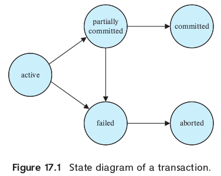

## 2. Elementos Esenciales

Puesto que usaremos T-SQL desde MySQL, todos los temas ya aprendidos sobre MySQL seran heradados por T-SQL.

   - **Sintaxis Básica:** Sintaxis básica de MySQL, incluyendo SELECT, INSERT, UPDATE, DELETE y CREATE TABLE.
   - **Tipos de Datos:** Descripción de los tipos de datos comunes utilizados en T-SQL, VARCHAR, DATE y DECIMAL. Además, aparecen algunos nuevos comandos como INT, BIGINIT, etc.
   - **Operadores Lógicos y Aritméticos:** Los operadores utilizados para realizar operaciones lógicas y aritméticas en MySQL seguiran funcionando para T-SQL.

## 3. Técnicas Avanzadas

Algunas técnicas avanzadas de T-SQL son:

   - Procedimientos Almacenados y Funciones
   - Manejo de Errores (bloques TRY...CATCH)
   - Expresiones de Tabla Común (CTEs)

## 4. Ejecución de Scripts

Para ejecutar los códigos de T-SQL, utilizaremos las mismas herramientas que hemos ya trabajdo:

- MySQL Workbench
- Línea de Comandos

Aunque no son los únicos que existen, nuestro objetivo es especializarnos en el uso de estas dos herramientas. Ya aprendido lo básico utilizar otro motor o herramienta involucra una curva de aprendizaje para la herramienta pero no para el lenguaje de programación SQL.

## 5. Programación de Transacciones

  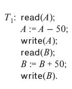
  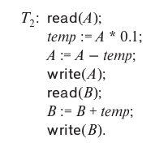

#### Sequencial

  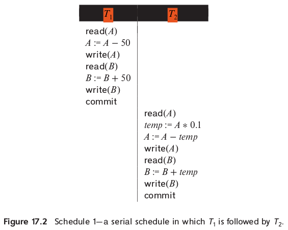

  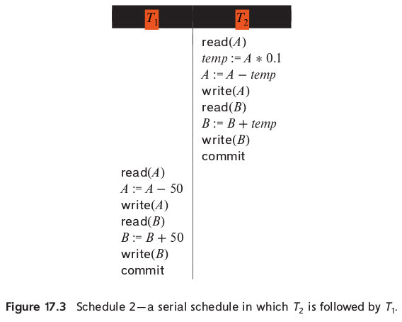

#### Concurrentes 

  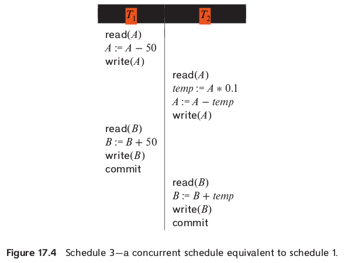

  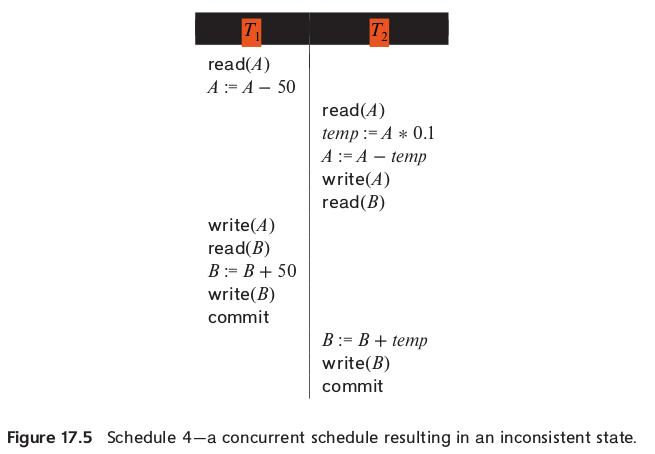

  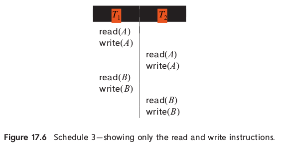

#### Equivalentes

  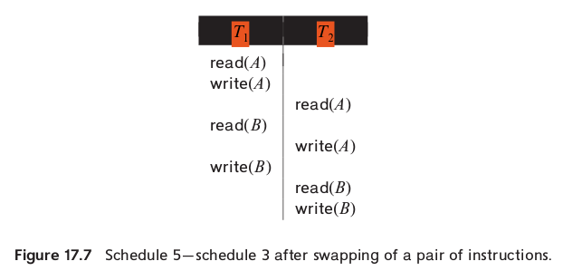

  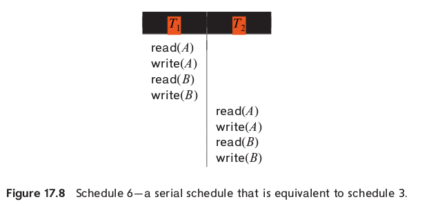

#### Recuperables y no Recuperables

  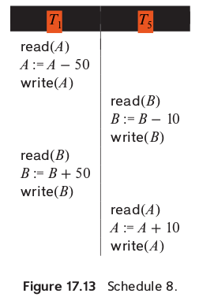

  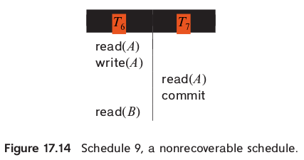

  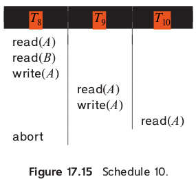

## Ejercicio Práctico

   - **Configuración de la Base de Datos:**
     - Crear una nueva base de datos MySQL llamada "banks" utilizando MySQL Workbench.
   - **Creación de Tablas y Datos de Muestra:**
     - Escribir scripts T-SQL para crear tablas que gestionen la información de los usuarios, cuentas y transacciones.
     - Insertar datos de muestra en las tablas utilizando instrucciones INSERT.
   - **Consultas y Manipulación de Datos:**
     - Escribir consultas T-SQL para recuperar información específica de la base de datos, como el número de transacciones por usuarios.
     - Realizar operaciones de manipulación de datos, como actualizaciones y eliminaciones, utilizando instrucciones UPDATE y DELETE.
   - **Procedimientos Almacenados:**
     - Crear procedimientos almacenados para realizar tareas específicas, como calcular el balance promedio de los usuarios.
   - **Manejo de Errores:**
     - Implementar manejo de errores en los scripts T-SQL para garantizar la robustez de las operaciones de base de datos.

Para este ejercicio utilizaremos la guia [MySQL Transactions](https://www.mysqltutorial.org/mysql-stored-procedure/mysql-transactions/) o [MySQL Transaction](https://www.javatpoint.com/mysql-transaction). Respecto a el último punto, manejo de errores, seguiremos alguno de los siguientes tutoriales: [TRY...CATCH (Transact-SQL)](https://learn.microsoft.com/en-us/sql/t-sql/language-elements/try-catch-transact-sql?view=sql-server-ver16) o [How to implement error handling in SQL Server](https://www.sqlshack.com/how-to-implement-error-handling-in-sql-server/).

## Ejercicio Casa

Realizen el mismo tutorial pero utilizando su propia base de datos. Deben entregar los códigos sql que escribieron.

## Conclusión
Al completar esta lección, los estudiantes tendrán un sólido entendimiento de la programación Transact-SQL (T-SQL) con MySQL. Estarán familiarizados con los elementos básicos y avanzados de T-SQL, así como con las formas de escribir y ejecutar scripts T-SQL en entornos MySQL. Esta habilidad es esencial para cualquier desarrollador o administrador de bases de datos que trabaje con MySQL en la industria.

## Referencias

- [15.3.1 START TRANSACTION, COMMIT, and ROLLBACK Statements](https://dev.mysql.com/doc/refman/8.0/en/commit.html)
- [Introduction to Transact-SQL](https://learn.microsoft.com/en-us/training/modules/introduction-to-transact-sql/)
- [MySQL Transaction](https://www.javatpoint.com/mysql-transaction)
- [How T-SQL is different from MySQL?](https://www.quora.com/How-T-SQL-is-different-from-MySQL)