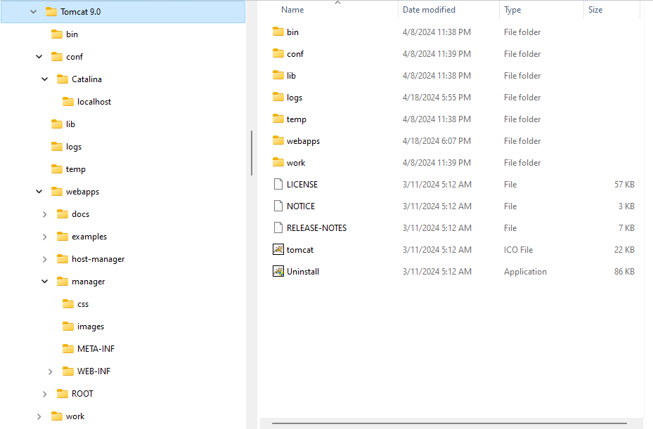
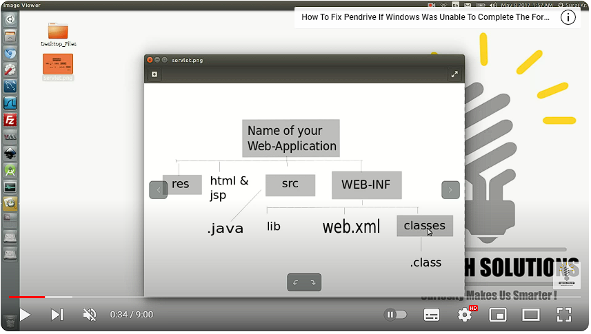

# Tomcat - Servidor de Aplicaciones

El objetivo de esta lección es proporcionar una comprensión práctica de Apache Tomcat, centrándose en conceptos básicos, configuración del servidor, despliegue de aplicaciones y trabajo con archivos de aplicación.

## 0. Conección mediante ssh

Antes de proceder a configurar Tomcat teminemos la práctica del uso de ssh. Para ello intetemos conectarnos a mi computador siguiedo las instrucciones del siguiente video [How to enable SSH on Linux Ubuntu (Easy step by step guide)](https://www.youtube.com/watch?v=Wlmne44M6fQ).

Mi ip es `172.21.12.242` y el usuario es `etitc` con la contraseña "*1234567890..*".

```bash
cut -d: -f1 /etc/passwd    # show users
sudo adduser new_username  # create user
nano /etc/sudoers          # edit the user privileges
newuser ALL=(ALL:ALL) ALL  # add this line inside the file sudoers and give root privileges
su - user_name             # to change user from terminal
```

Para mayor información ingresen a [How to Add and Delete Users on Ubuntu 20.04](https://www.digitalocean.com/community/tutorials/how-to-add-and-delete-users-on-ubuntu-20-04).

Ahora intenten conectarse a el computador de un compañero, para ello primero creen un usuario y agreguen una clave como la de ejemplo u otra. 

## 1. Conceptos Básicos

Apache Tomcat es un servidor web y contenedor de servlets de código abierto desarrollado por la Apache Software Foundation. Se utiliza para ejecutar aplicaciones web Java, incluidos Servlets, JavaServer Pages (JSP) y otras tecnologías Java EE.

## 2. Configuración del Servidor

- Descarga de Tomcat: Visita el sitio web de Apache Tomcat (https://tomcat.apache.org/) y descarga la última versión de Tomcat. 
- Instalación: Extrae el archivo descargado en la ubicación preferida en tu sistema.
- Iniciar Tomcat: Navega al directorio `bin` dentro de la carpeta de instalación de Tomcat y ejecuta el script `startup.bat` (Windows) o `startup.sh` (Unix).
- Acceder a Tomcat: Abre un navegador web y ve a `http://localhost:8080`. Deberías ver la página de bienvenida de Tomcat si el servidor se está ejecutando correctamente.

## 3. Despliegue de Aplicaciones

- Directorio de Despliegue de Aplicaciones: Copia tu aplicación (en forma de archivo .war) al directorio `webapps` dentro de la carpeta de instalación de Tomcat.
- Despliegue Automático: Tomcat despliega automáticamente la aplicación extrayendo su contenido en un directorio con el mismo nombre que el archivo .war (por ejemplo, `myapp.war` se despliega en `webapps/myapp`).
- Despliegue Manual: También puedes desplegar manualmente una aplicación creando un directorio con la ruta de contexto deseada y copiando los archivos de la aplicación en él.

## 4. Trabajo con Archivos de Aplicación


- **web.xml:** Es el archivo de descriptores de despliegue web para una aplicación web en Java. Define configuraciones como servlets, filtros, escuchadores de contexto y mapeos URL.

- **Servlet:** Un servlet es un componente de aplicación Java que se ejecuta en el servidor y procesa las solicitudes HTTP.

- **Servlet Mapping:** Mapea las URL de las solicitudes HTTP a los servlets correspondientes en la aplicación web.

- **Archivo .war:** El archivo .war (Web ARchive) es un archivo comprimido que contiene los archivos de una aplicación web, incluidos los archivos JSP, HTML, servlets, clases Java y bibliotecas. Un archivo .war típicamente incluye un directorio `WEB-INF`, que contiene el descriptor de despliegue web.xml, directorio de clases (para clases de servlet), y directorio de librerías (para bibliotecas).

## 5. Estructura de Carpetas

La estructura de carpetas para desplegar aplicaciones web en Tomcat generalmente incluye los siguientes directorios principales:




- **apps:** Este directorio contiene las aplicaciones web desplegadas en Tomcat. Cada aplicación web se almacena en un directorio separado dentro de este directorio.

- **bin:** Contiene los scripts y archivos ejecutables para iniciar y detener el servidor Tomcat, así como otros scripts de utilidad.

- **conf:** Aquí se almacenan los archivos de configuración de Tomcat, como `server.xml` (configuración del servidor), `web.xml` (descriptores de despliegue web) y otros archivos de configuración.

- **lib:** Este directorio contiene las bibliotecas compartidas (JAR) utilizadas por todas las aplicaciones web desplegadas en Tomcat.

- **logs:** Almacena los archivos de registro generados por Tomcat.

- **temp:** Directorio temporal utilizado por Tomcat para almacenar archivos temporales.

- **webapps:** Es el directorio principal donde se despliegan las aplicaciones web. Cada aplicación web se despliega en un subdirectorio dentro de este directorio.

- **work:** Directorio de trabajo utilizado por Tomcat para almacenar archivos generados durante la compilación de JSP y otros procesos temporales.


## Ejercicio Práctico

1. **Configuración del Servidor Tomcat:**
   - Descarga e instala Apache Tomcat en tu sistema.
   - Inicia el servidor Tomcat utilizando el script de inicio.
   - Accede a la página de bienvenida de Tomcat en tu navegador web.
  
   En Windows esta instalación es sencilla y rápida pero vamos a relizarla en linux, para ello sigan el tutorial [How To Install Apache Tomcat 10 on Ubuntu 20.04](https://www.digitalocean.com/community/tutorials/how-to-install-apache-tomcat-10-on-ubuntu-20-04). Lo único que deben modificar es el enlace de la descargar, utilicen este:

   ```bash
   wget https://dlcdn.apache.org/tomcat/tomcat-10/v10.1.20/bin/apache-tomcat-10.1.20.tar.gz
   ```

   Como ejercicio adicional cambia al puerto 8081, si gustan pueden dejarlo en este puerto o  cambiarlo al que viene por defecto.

2. **Despliegue de una Aplicación:**
   
   Crea una aplicación web simple (por ejemplo, una aplicación usando servlets que muestre "¡Hola, Mundo!"). El código ejemplo lo pueden sacar de `http://localhost:8080/examples/servlets/`, sin embargo realizaremos el tutorial <br> <br> 
   
   [](https://www.youtube.com/watch?v=6yyZsEfOEu4)

   Recuerden que existen dos pasos para la creación de una aplicación: 
   
   1. **Despliegue (deploy):** 
   
      Se crea la estrcutura de la página web, todas las carpetas que deben ir y los archivos xml. Para esta parte pueden seguir el tutorial que tiene tomcat, [Development Processes - Tomcat 10](https://tomcat.apache.org/tomcat-10.0-doc/appdev/processes.html).

   2. **Adición de Servlets:** 
   
      Se agregan y ejecutan códigos de java con servlets y se configuran estos servlets en el archivo `web.xml`. Pueden seguir el tutorial [Java Server-Side Programming - ntu](https://www3.ntu.edu.sg/home/ehchua/programming/java/JavaServlets.html) para crear los primeros servlets en la página web. Recuerden que el código que deben usar para compilar los códigos de java es:

      ```bash
      javac -cp /opt/tomcat/lib/servlet-api.jar -d path_to/classes/ WEB-INF/src/mypkg/EchoServlet.java
      ```

      Si lo ejecutaron correctamente debe aparecer un nuevo archito tipo java class en la carpeta `classes`.

3. **Empaquetamiento de la aplicación:** 

   Ahora, el siguiente paso es empaquetar la aplicación en un archivo war con el fin de poder compartirla de forma simple y sencilla. Para ello, estando en la carpeta de la aplicación (`/opt/tomcat/webapps/my_web_app`) ejecuten el siguiente comando

   ```bash
   jar -cvf my_web_app.war *
   ```

4. **Exploración de Archivos de Aplicación:**

   - Navega al directorio donde se desplegó la aplicación (`webapps/myapp`).
   - Explora el contenido del archivo .war, incluido el directorio `WEB-INF` y su contenido.
   - Implementar su estructura y contenido en tu aplicación.

4. **Personaliza el contenido:**

- Agrega el contenido html, css, y de js de la carta utilizando git.

5. **Descarga y despliega un .war file:**

- Descarga alguno de los siguientes archivos war:
   - [Sample war file - VIU.ca](http://csci.viu.ca/~barskym/teaching/DM2012/labs/LAB6/SampleApp.html)
   - [Sample Application - Tomcat](https://tomcat.apache.org/tomcat-7.0-doc/appdev/sample/)
   - [Example Hello World WAR-File](https://github.com/aeimer/java-example-helloworld-war?tab=readme-ov-file)

- Buscar un archivo war y desplegarlo.

6. **La nueva era: Django - Python:** 

   Sigue el tutorial para el despliegue del servidor, [Writing your first Django app, part 1](https://docs.djangoproject.com/en/5.0/intro/tutorial01/), y agrega una aplicación al servidor.

Revisen el capítulo 3 del libro guia Professional Java for Web Applications de Nicholas S. Williams por si tienen dudas o quieren profundizar en los temas.

#### Conclusión
Este ejercicio práctico proporciona experiencia práctica con Apache Tomcat, cubriendo la configuración básica, el despliegue de aplicaciones y el trabajo con archivos de aplicación. Experimentar con estos conceptos mejorará tu comprensión del desarrollo de aplicaciones web utilizando Tomcat.

## Ejercicio: Creación de aplicación 

0. Copiar la carta a la carpeta raiz de la aplicación organizando los archivos según la estrctura del primer capítulo de la guia en el siguiente punto. 
1. Quienes ya hicieron el tutorial pueden subir lo que ya hicieron o si quieren hacer el nuevo tutorial que es más completo [Java Server-Side Programming - ntu](https://www3.ntu.edu.sg/home/ehchua/programming/java/JavaServlets.html), desarollen los primeros 5 capítulos, **lean las intrucciones y explicaciones**. El error que les va a salir al compilar los archivos es por la versión de java que ellos tienen, los códigos en nuestra version de java estan en la carpeta [códigos](./codigos).
2. Agregar, adecuar, y modificar los servlets del repositorio [basic-servlet-example](https://github.com/jgpreetham/basic-servlet-example) a nuestra webpp HelloServlet. Todos los enlaces que estan en el index deben funcionar.
3. Empaquetar la aplicación utilizando el comando `jar` como se mostró en la anterior sección, aqui crearan un archivo terminado en war.
4. Desplieguen el archivo war pero primero cambienle el nombre y agreguenle al que ya tiene algo como _1, es decir, de *myapp* pasaria a *myapp_1*. Con eso crearan una nueva webapp y no sobreescribiran la que ya tienen.
5. Parados en la carpeta del webapp, `/opt/tomcat/webapps/myapp/`, clonen el repositorio de la carta. Esto creara una nueva carpeta que podran visualizar desde el navegador.
6. (Opcional) Completen los tutoriales de Django, hacer la parte [part 2](https://docs.djangoproject.com/en/5.0/intro/tutorial02/) y la parte [part 3](https://docs.djangoproject.com/en/5.0/intro/tutorial03/).


Les sugieron que creen un respositorio y vayan subiendo las cosas allí, así si tienen un problema o aparece un daño pueden deolver a una versión antigua y no fan a sufrir. Lo pueden hacer via terminal o usando la extensión de visual studio code (vsc). Si lo hacen desde vsc accedan a su cuenta de git desde el icono de perfil que esta en la parte inferior izquierda; si lo hacen desde terminal deben de registrar su usuario y correo

```bash
git config --global user.name "John Doe"
git config --global user.email johndoe@example.com
```

Para hacer los comentarios y subir la información van a utilizar los siguientes comandos, deben estar en la carpeta del repositorio.

```bash
git pull                               # actualiza el repositorio local en caso de que existan cambios
git add .                              # agregar todos (.) los cambios
git commit -m "agregan un comentario"  # agregar un comentario
git push                               # envia toda la información a github
```

Aca les dejo una guia por si tienen dudas [git - la guía sencilla
](https://rogerdudler.github.io/git-guide/index.es.html). Si les pone algún problema usen `git push origin master` como aparece en la guia.

### Entregrables

Entreguen un archivo de word con pantallazo de cada paso, que se note que funciona bien el Tomcat y que además pueden ingresar al Host Manager y a Manager App con los usuarios que crearon (anexen pantallazo donde se vea que estan ingresando con ese usuario). **Cada pantallazo debe de mostrar que es su imagen y no la de alguien más**, para ello pueden subir el pantallazo con la camara prendida, o con una pestañana donde esten en el correo institucional, o algo por el estilo que los logre identificar.

Además, anexen el archivo war generado y si hacen lo de django pantallazos de que les funciono, recuerden que esto último es opcional y a quienes lo hagan se les dara puntos extra.

**Resumen:** Un archivo de word y un archivo .war.

## Referencias

#### Guias Tomcat

- [Getting Started With Apache Tomcat](https://dzone.com/refcardz/getting-started-with-apache-tomcat)
- [Documentation Index](https://tomcat.apache.org/tomcat-10.0-doc/index.html)
- [Mastering Apache Tomcat : A Comprehensive Guide For Webserver Setup](https://www.youtube.com/watch?v=c7qZAL1bHi0)
- [Tomcat - A Minimalistic User's Guide](https://tomcat.apache.org/tomcat-3.2-doc/uguide/tomcat_ug.html)
- [Java-Servlets](https://github.com/SuneetPatil/Java-Servlets?tab=readme-ov-file)

#### Complementos

- [Professional-Java-for-Web-Applications](https://github.com/sergiy-naumovych/Professional-Java-for-Web-Applications)
- [3. DEPLOYMENT ORGANIZATION](https://tomcat.apache.org/tomcat-3.2-doc/appdev/deployment.html)
- [Java Webapps Tutorial](https://cs.lmu.edu/~ray/notes/jw/)
