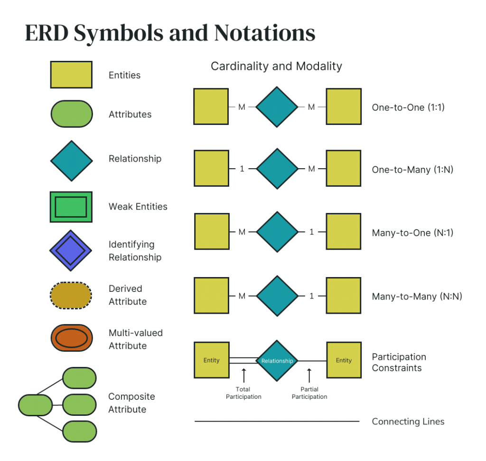
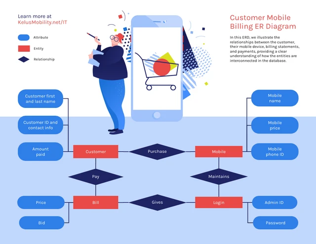

# Modelo Entidad-Relación (E/R)

## 1. Conceptos Básicos

El Modelo Entidad-Relación (E/R) es un modelo de datos conceptual utilizado para representar las entidades, atributos y relaciones dentro de un sistema de base de datos. Proporciona una representación gráfica de la estructura de la base de datos, lo que permite a los interesados comprender la organización de los datos y las interacciones entre las entidades.

  

  

    
  

  

    <h2>Some title text</h2>
    
Some more text that will appear to the left of the image.

  

Cada entidad contiene atributos clave, incluida una clave primaria que identifica de forma exclusiva cada registro dentro del conjunto de entidades. Las relaciones, representadas por líneas entre estas entidades, muestran cómo los datos de una entidad se relacionan con los datos de otra, ya sea a través de un emparejamiento de clave primaria y clave externa en una relación de uno a muchos o una relación de muchos a muchos que requiere una tabla de unión. 

   

Tomado de y adaptado de [What is an Entity Relationship Diagram and How to Draw one?](https://venngage.com/blog/entity-relationship-diagram/).
## 2. Características y Aplicaciones

- **Flexibilidad:** El modelo E/R ofrece flexibilidad para representar escenarios del mundo real al abstraer estructuras complejas en entidades y relaciones más simples.
- **Claridad:** Proporciona una visualización clara e intuitiva del esquema de la base de datos, ayudando en la comunicación entre los interesados.
- **Estandarización:** El modelo E/R sigue una notación y terminología estandarizadas, lo que lo hace ampliamente aceptado y comprendido en la comunidad de bases de datos.

## 3. Elementos del Modelo E/R

- **Entidades:** Representan objetos o conceptos del mundo real, como una persona, lugar o cosa. En el modelo E/R, las entidades se representan como rectángulos.
- **Atributos:** Son propiedades o características de las entidades. Los atributos se representan como óvalos conectados a sus respectivas entidades.
- **Relaciones:** Son asociaciones entre entidades que describen cómo están relacionadas entre sí. Las relaciones se representan como diamantes que conectan las entidades relacionadas.

## 4. Requisitos para una Relación

Para que exista una relación entre entidades, se deben cumplir ciertas condiciones:

- **Existencia de Entidades:** Ambas entidades involucradas en la relación deben existir. Por ejemplo, para establecer una relación entre "País" y "Ciudad" en la base de datos "world", ambas entidades deben estar definidas previamente.
- **Asociación:** Debe haber una asociación o conexión significativa entre las entidades. Por ejemplo, una ciudad debe pertenecer a un país específico para establecer una relación entre ellos.
- **Cardinalidad:** La cardinalidad define el número de ocurrencias de una entidad que están asociadas con el número de ocurrencias de otra entidad. Incluye valores mínimos y máximos, como relaciones uno a uno, uno a muchos o muchos a muchos.
- **Participación:** La participación indica si una entidad debe o no participar en una relación. Puede ser total (obligatoria) o parcial (opcional).
- **Claves:** Las claves son atributos o conjuntos de atributos que identifican de manera única a las entidades dentro de una relación. Pueden ser claves primarias (PK) o claves foráneas (FK).

## Ejemplo utilizando la Base de Datos *world*

Consideremos las siguientes entidades de la base de datos "world":

- Entidad: `Country`
  Atributos: `Code`, `Name`, `Continent`, `Population`

- Entidad: `City`
  Atributos: `ID`, `Name`, `CountryCode`, `Population`

#### Relación

- Relación: `Country-City`
  Cardinalidad: Uno a muchos (Un país puede tener muchas ciudades)
  Participación: Total en el lado de los países (Todos los países deben tener al menos una ciudad)
  Claves: `Country.Code` (Clave primaria), `City.CountryCode` (Clave foránea)

## Conclusión

El Modelo Entidad-Relación es una herramienta fundamental en el diseño de bases de datos, que permite a los desarrolladores conceptualizar y visualizar la estructura de un sistema de base de datos. Comprender los conceptos básicos, características, elementos y requisitos del modelo E/R es esencial para diseñar bases de datos eficientes y efectivas. Mediante ejemplos de la base de datos "world", los estudiantes pueden aplicar estos conceptos en escenarios del mundo real y adquirir experiencia práctica en modelado y diseño de bases de datos.

## Referencias

- [The-MySQL-Workshop](https://github.com/PacktWorkshops/The-MySQL-Workshop/tree/master)
- [ER Diagrams (Data Modeling)](https://github.com/mehdihadeli/awesome-software-architecture/blob/main/docs/modeling/er-diagrams.md)
- [Awesome Database Design Awesome](https://github.com/sujeet-agrahari/awesome-database-design?tab=readme-ov-file)
- [Domain Modeling & ERDs](https://github.com/sei-relativity/lesson-w07d05-Entity-Relationship-Diagram)
- [MySQL: Entity Relationship Model](https://www.linkedin.com/pulse/mysql-entity-relationship-model-cyclobold-tech/)