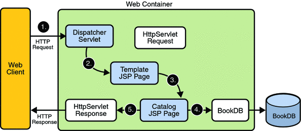

# Servlets y JavaServer Pages (JSP)

## Introducción a los Servlets en la Programación de Aplicaciones Web

###  1. ¿Qué son los Servlets?

Los Servlets son clases Java utilizadas para extender las capacidades de los servidores que alojan aplicaciones accesibles mediante un modelo de programación de solicitud-respuesta. Son el esqueleto del desarrollo web en Java, proporcionando una forma de generar contenido dinámico y manejar las solicitudes de los usuarios en el lado del servidor.

### 2. Configuración del Entorno Servlet
Antes de escribir servlets, asegúrate de tener:
- Java Development Kit (JDK) instalado.
- Un contenedor de servlets como Apache Tomcat, Jetty o GlassFish.
- Un Entorno de Desarrollo Integrado (IDE) como Eclipse, IntelliJ IDEA o NetBeans. O en nuestro caso via terminal.

### 3. Escribir tu Primer Servlet
Creemos un simple "HelloWorldServlet" para entender los conceptos básicos.

```java
import java.io.IOException;
import javax.servlet.ServletException;
import javax.servlet.http.HttpServlet;
import javax.servlet.http.HttpServletRequest;
import javax.servlet.http.HttpServletResponse;

public class HelloWorldServlet extends HttpServlet {
    protected void doGet(HttpServletRequest request, HttpServletResponse response)
            throws ServletException, IOException {
        response.setContentType("text/html");
        response.getWriter().println("<html><body>");
        response.getWriter().println("<h1>Hola, Mundo!</h1>");
        response.getWriter().println("</body></html>");
    }
}
```

### 4. Configuración del Servlet
Para configurar un servlet, necesitas crear un archivo de descriptor de despliegue (web.xml) o utilizar anotaciones.

```xml
<web-app>
    <servlet>
        <servlet-name>HelloWorldServlet</servlet-name>
        <servlet-class>HelloWorldServlet</servlet-class>
    </servlet>
    <servlet-mapping>
        <servlet-name>HelloWorldServlet</servlet-name>
        <url-pattern>/hello</url-pattern>
    </servlet-mapping>
</web-app>
```

### 5. Ciclo de Vida del Servlet
Los Servlets siguen un ciclo de vida que consta de tres etapas principales: inicialización, manejo de solicitudes y destrucción. Este ciclo de vida es gestionado por el contenedor de servlets.

1. **Inicialización:** El contenedor de servlets carga la clase del servlet y llama a su método `init()`.
2. **Manejo de Solicitudes:** Para cada solicitud del cliente, el contenedor de servlets invoca el método `service()`, que a su vez llama a `doGet()`, `doPost()`, etc., según el método HTTP utilizado.
3. **Destrucción:** Cuando el contenedor de servlets se apaga o decide descargar el servlet, llama al método `destroy()`.

<p float="left" style="text-align:center">
  
</p>

### 6. Manejo de Solicitudes y Respuestas HTTP
Los Servlets pueden manejar varios métodos HTTP como GET, POST, PUT, DELETE, etc., y generar contenido dinámico basado en las solicitudes de los usuarios.

```java
protected void doGet(HttpServletRequest request, HttpServletResponse response)
        throws ServletException, IOException {
    // Procesar solicitud GET
}

protected void doPost(HttpServletRequest request, HttpServletResponse response)
        throws ServletException, IOException {
    // Procesar solicitud POST
}
```

### 7. Anotaciones de Servlet (Servlet 3.0+)
Puedes utilizar anotaciones para definir servlets y sus mapeos directamente en la clase del servlet, lo que facilita el proceso de configuración.

```java
import javax.servlet.annotation.WebServlet;

@WebServlet("/hello")
public class HelloWorldServlet extends HttpServlet {
    // Código del servlet aquí
}
```

### Conclusión
Los Servlets son componentes esenciales en el desarrollo web en Java, permitiendo a los desarrolladores crear aplicaciones web dinámicas e interactivas. Entender los fundamentos de los servlets es crucial para construir aplicaciones web robustas y eficientes. Practica escribir servlets y explora características avanzadas para mejorar tus habilidades en el desarrollo web.

## JavaServer Pages (JSP)


### 1. ¿Qué son JavaServer Pages (JSP)?
Las JavaServer Pages (JSP) son una tecnología utilizada para crear páginas web dinámicas mediante la incrustación de código Java en páginas HTML. Proporcionan una forma de separar la capa de presentación de la lógica de negocio, permitiendo a los desarrolladores escribir código Java directamente en la página web.

### 2. Configuración del Entorno JSP
Antes de trabajar con JSP, asegúrate de tener:
- Java Development Kit (JDK) instalado, "es lo mismo que openjdk".
- Un contenedor de servlets como Apache Tomcat, Jetty o GlassFish.
- Un Entorno de Desarrollo Integrado (IDE) como Eclipse, IntelliJ IDEA o NetBeans. O en nuestro caso la terminal.

### 3. Escribir tu Primer JSP
Creemos una página simple "HelloWorld.jsp" para entender los conceptos básicos.

```jsp
<!DOCTYPE html>
<html>
<head>
    <title>Hola Mundo JSP</title>
</head>
<body>
    <h1>Hola, Mundo!</h1>
    <%  String mensaje = "¡Bienvenido a JSP!";
        out.println("<p>" + mensaje + "</p>");
    %>
</body>
</html>
```

Recuerden que nuestra guia prinpical sera [Getting started with JSP by Examples - ntu](https://www3.ntu.edu.sg/home/ehchua/programming/java/JSPByExample.html).

### 4. Directivas JSP
Las directivas JSP proporcionan instrucciones al contenedor sobre el archivo JSP y cómo debe ser procesado. Hay tres tipos principales de directivas:
- **Directiva de Página:** Define atributos y configuraciones específicos de la página.
- **Directiva de Inclusión:** Incluye el contenido de otro archivo durante el tiempo de traducción.
- **Directiva de Biblioteca de Etiquetas:** Declara una biblioteca de etiquetas que proporciona etiquetas personalizadas para usar en la página JSP.

### 5. Elementos de Scripting en JSP
JSP permite incrustar código Java directamente en la página HTML mediante elementos de scripting. Hay tres tipos de elementos de scripting:

- **Directivas:**: Encerradas entre etiquetas `<%@page|include ... %>` y utilizados para dar indicaciones al motor de JSP.
- **Comentarios:** Encerrados entre etiquetas `<%-- -->` y utilizados para agregar comentarios.
- **Scriptlets:** Encerrados entre etiquetas `<% %>` y utilizados para escribir código Java.
- **Expresiones:** Encerradas entre etiquetas `<%= %>` y utilizadas para evaluar y mostrar expresiones.
- **Declaraciones:** Encerradas entre etiquetas `<%! %>` y utilizadas para declarar variables y métodos.

### 6. Acciones Estándar de JSP
Las acciones estándar de JSP son etiquetas similares a XML utilizadas para realizar tareas comunes como incluir otros archivos, reenviar solicitudes y manejar excepciones. Algunas acciones estándar comunes incluyen:
- `<jsp:include>`: Incluye contenido de otro recurso.
- `<jsp:forward>`: Reenvía la solicitud a otro recurso.
- `<jsp:useBean>`: Instancia un JavaBean.
- `<jsp:setProperty>`: Establece las propiedades de un JavaBean.

### 7. Objetos Implícitos
JSP proporciona un conjunto de objetos predefinidos conocidos como objetos implícitos que están automáticamente disponibles para todas las páginas JSP. Algunos objetos implícitos comunes incluyen:
- `request`: Representa la solicitud del cliente al servidor.
- `response`: Representa la respuesta del servidor al cliente.
- `session`: Representa la sesión del usuario.
- `out`: Representa el flujo de salida para escribir contenido en el navegador del cliente.

### 8. Ciclo de Vida de JSP

<p float="left" style="text-align:center">
  
  
</p>


### Conclusión
Las JavaServer Pages (JSP) proporcionan una forma poderosa de crear páginas web dinámicas mediante la combinación de HTML con código Java. Comprender los fundamentos de JSP, incluidas las directivas, los elementos de scripting, las acciones estándar y los objetos implícitos, es esencial para construir aplicaciones web robustas e interactivas. Practica escribir páginas JSP y explora características avanzadas para mejorar tus habilidades en el desarrollo web.


## References

### Libros

- Nicholas S. Williams. *Professional Java® for Web Applications*. Wrox primera edición, 2014 Capítulo 4, paǵina 73.
- Joel Murach y Michael Urban. *Murach’s Java Servlets and JSP*. Mike Murach & Associates 3ra edición, 2014. Capítulo 6, página 193.

### Guias

- [Getting started with JSP by Examples - ntu](https://www3.ntu.edu.sg/home/ehchua/programming/java/JSPByExample.html)
- [JSP Example Tutorial for Beginners](https://www.digitalocean.com/community/tutorials/jsp-example-tutorial-for-beginners)
- [JSP Tutorial](https://www.javatpoint.com/jsp-tutorial)
- [Introduction to JSP](https://www.geeksforgeeks.org/introduction-to-jsp/)

### Repositorios

- [JSP-Tutorial](https://github.com/RameshMF/JSP-Tutorial?tab=readme-ov-file)
- [jsp-servlet-example](https://github.com/yotammadem/jsp-servlet-example)
- [SimpleJspWebsite](https://github.com/pH-7/SimpleJspWebsite)
- [simple-servlet](https://github.com/ExeterBScDTS/simple-servlet)